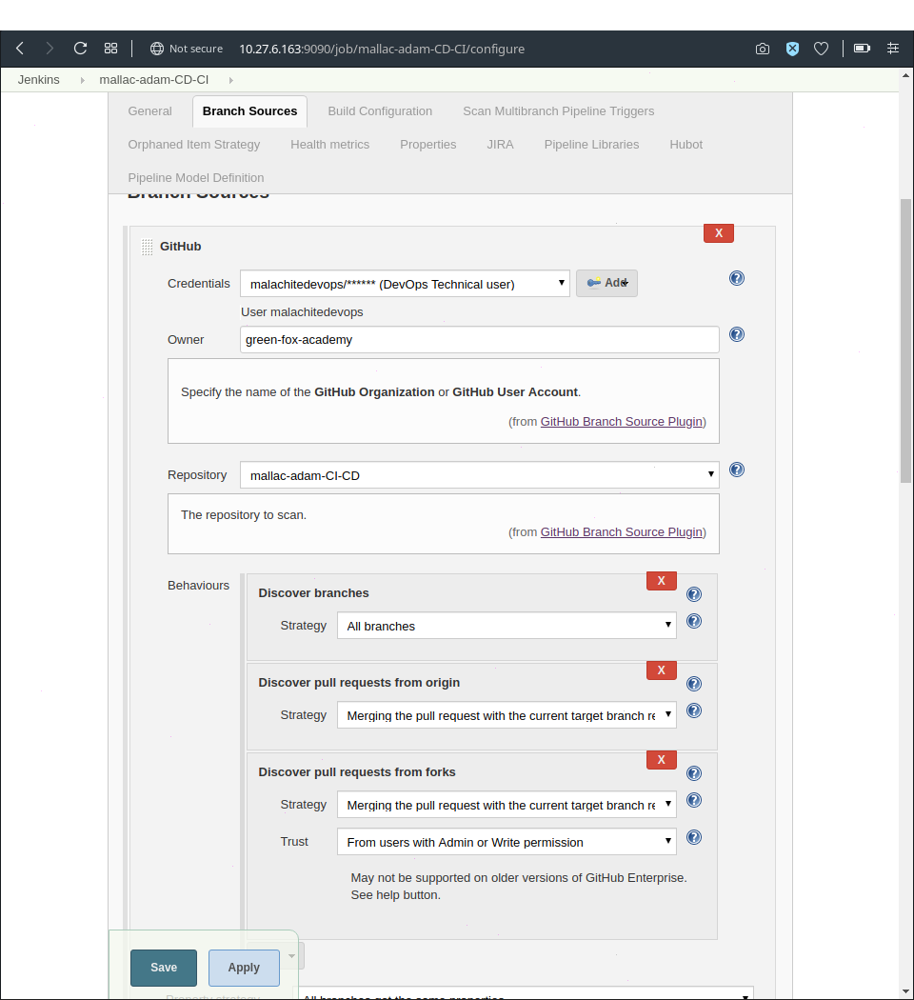

# Continuous Integration/Continuous Delivery

## Webhooks

Webhooks can be installed on GitHub repositories or organizations. They trigger on specific events - pull requests in our case, - sending a HTTP POST payload to a specified URL, triggering another event elsewhere.

### Creating webhooks

A GitHub repository with multiple branches is a prerequisite for this task.

To set up a webhook, go to the settings page of your repository or organization. From there, click Webhooks, then Add webhook.

The payload URL should look like this: `http://195.228.147.126:9090/ghprbhook/`

`The IP address of your Jenkins server + the number of the port Jenkins listens on + /ghprbhook/`

## Creating the Jenkins job

After loggin in to Jenkins click on `New item` (left side.) Name your job, then choose `Multibranch Pipeline` and click on `OK`.

Adding a Display name and Description are optional.

Under `Branch sources` click on `Add source` and select `GitHub`.

You should see this:

Select your credentials.
Enter the owner of the repository\organization in the `Owner` field.
Select the name of the repository in the `Repository` field. Note that the options might appear with a few seconds delay.

