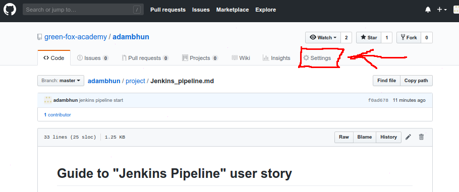
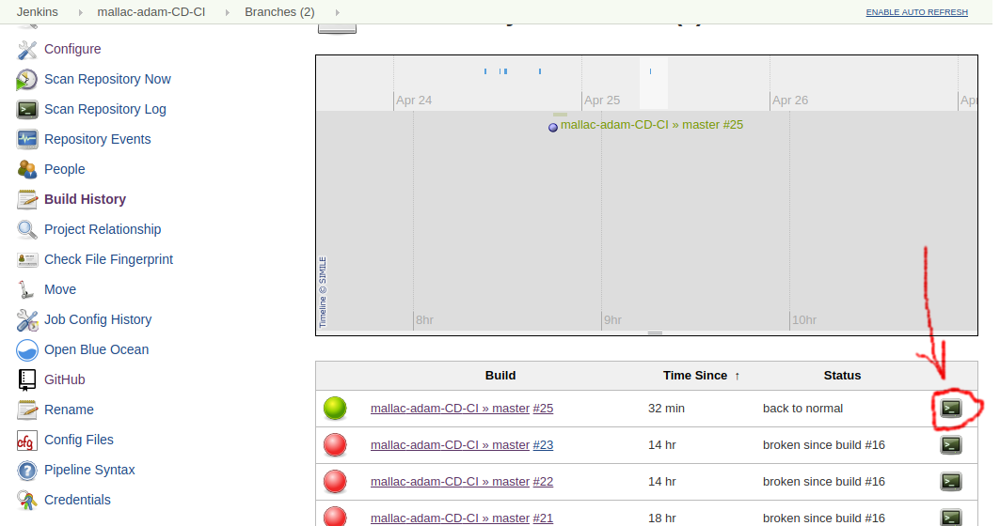

# Continuous Integration/Continuous Delivery

[My repo for this user story](https://github.com/green-fox-academy/mallac-adam-CI-CD)

## Prerequisites

- AWS account
- Docker account
- Jenkins server set up (credentials for Dockerhub and AWS)
- Multibranch gitHub repository with a webhook
- An elastic beanstalk application

### Creating the webhook

To set up a webhook, go to the settings page of your repository or organization. From there, click Webhooks, then Add webhook.



The payload URL should look like this: `http://195.228.147.126:9090/ghprbhook/`

`The IP address of your Jenkins server + the number of the port Jenkins listens on + /ghprbhook/`

The rest of the setting can be left on their default values.

### Credentials on Jenkins

On the home page of Jenkins, click on `Credentials` on the left.
Select `System` from the drop-down menu.
On the next page click on `Global credentials`.
The `Add Credentials` button will appear on the top left. Click on it, and then you can start adding your credentials.

## Creating the Jenkins job

After logging in to Jenkins click on `New item` (left side.) Name your job, then choose `Multibranch Pipeline` and click on `OK`. The configuration page will be loaded:


Adding a Display name and Description are optional.

### Branch sources

Under `Branch sources` click on `Add source` and select `GitHub`.

Select your credentials.

Enter the owner of the repository\organization in the `Owner` field.

Select the name of the repository in the `Repository` field. Note that the options might appear with a few seconds delay.

You can leave the rest of the settings of `Branch sources` on their default values.

### Build configuration

For the `Mode` option select `by Jenkinsfile`.
The `Script Path` should be `Jenkinsfile`.

You can leave the rest of the settings on their default values. Click on `Save`.

## Repo contents

The gitHub repository should contain the following files at least:

- Nodejs application
- test for the application
- Dockerfile
- Jenkinsfile
- Dockerrun.aws.json file

### Dockerfile contents

```
FROM alpine:latest
RUN apk add --no-cache nodejs npm
WORKDIR /app
COPY . /app
RUN npm install
EXPOSE 3000
ENTRYPOINT ["node"]
CMD ["hello.js"]
```

Explanation: I included a simple express server js application to prevent the Docker container from crashing.

### Dockerrun.aws.json contents

```
{
  "AWSEBDockerrunVersion": "1",
  "Image":{
    "Name": "adambhun/CD_CI"
  },
    "Ports": [       {
      "ContainerPort": "3000",
      "hostPort": "3000"
    }
  ]
}
```

### Jenkinsfile contents

```
pipeline {
  environment {
    registry = "adambhun/multibranch-ci-cd"
    dockerCred = 'adambdhub'
    dockerImage = ''
  }
  agent any
  stages {
    stage('Testing') {
      steps {
        sh 'npm init -y'
        sh 'npm install'
        sh 'node anagramtest.js'
      }
    }
    stage('Building image') {
      steps{
        script {
          docker.build registry + ":$BUILD_NUMBER"
        }
      }
    }
    stage('Deploy Image') {
      steps{
        script {
          docker.withRegistry( '', dockerCred ) {
            sh 'docker push adambhun/multibranch-ci-cd:latest'
          }
        }
      }
    }
    stage('Deploy to EB') {
      when {
        branch 'master'
      }
      steps{
        withCredentials([[$class: 'AmazonWebServicesCredentialsBinding', accessKeyVariable: 'AWS_ACCESS_KEY_ID', credentialsId: 'adam_dev_aws', secretKeyVariable: 'AWS_SECRET_ACCESS_KEY']]) {
          sh 'pip install awsebcli --upgrade --user'
          sh 'eb deploy green --version app-c5f1-190425_140158'
        }
      }
    }
    stage('Cleanup') {
      steps{
        sh 'docker rmi $registry:$BUILD_NUMBER'
        sh 'rm -r node_modules'
        sh 'rm package.json'
      }
    }
  }
}
```

Explanation:

- setting the environment variables
  - registry is your Dockerhub repository
  - dockerCred is your Docker credentials stored in Jenkins
- Testing
  - set up dependencies
  - run tests
- Building image
  - specify an image name after 'docker.build'
- Deploy Image
  - wrap the shell script that pushes the images as above, so Jenkins is authorized
- Deploy to EB
  - wrap the shell script that deploys to EB as above, so Jenkins is authorized
    Shell script explanation:
    - install ebcli and its dependencies
    - to update an existing application, give the command `eb deploy [your environment name] --version [your application's version]`
    - to create an EB application and an environment, the command should look like this:
    ```
     sh 'eb init --region [region of your choice] -p docker [container name]'
     sh 'eb create CD-no-$BUILD_NUMBER'
     ```
- Cleanup
  - clear the docker images and dependencies so they don't take up storage space on your server


## Testing the Jenkins project

Find your Jenkins project on the home page of your Jenkins server and click on it.


Click on `Scan Repository Now` to begin the test. It can take up to five minutes with a simple application.

To see a detailed log of what happened, click on the `Build History`, and click on the `console output` icon on the right of the field of your latest build.

