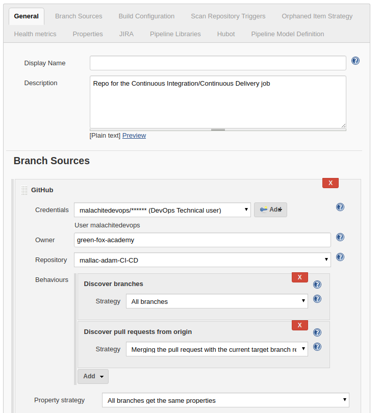
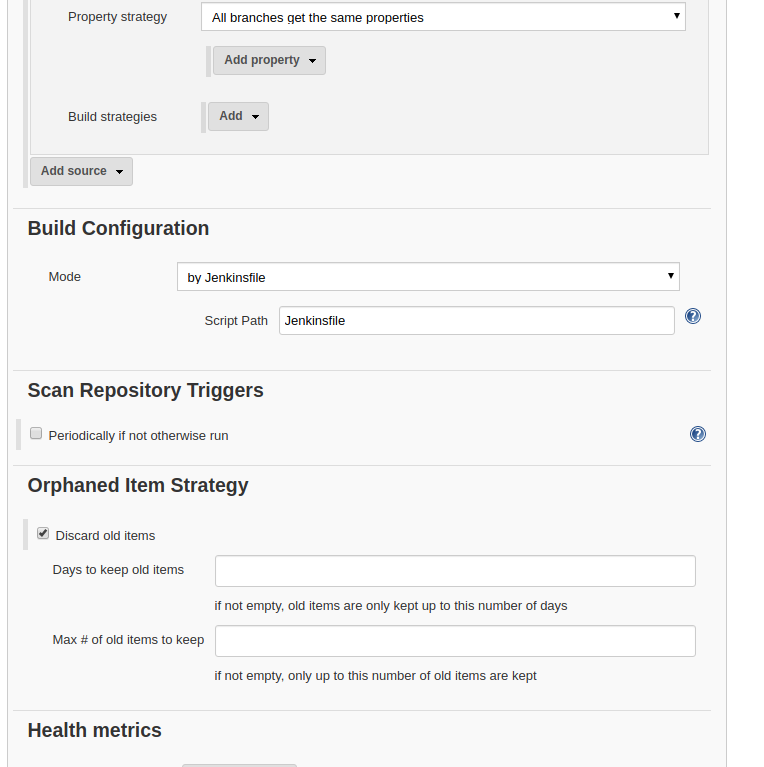
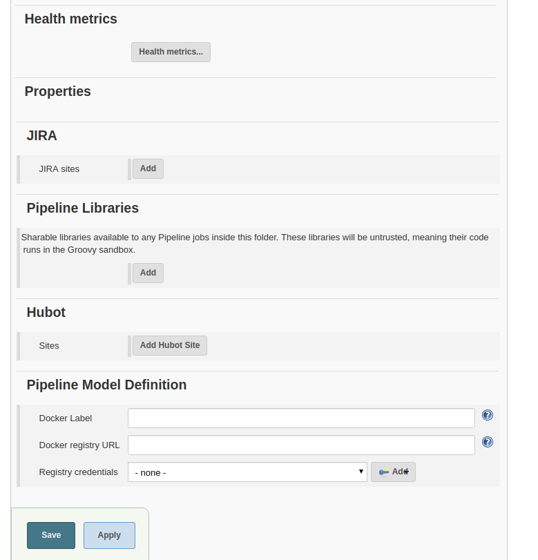
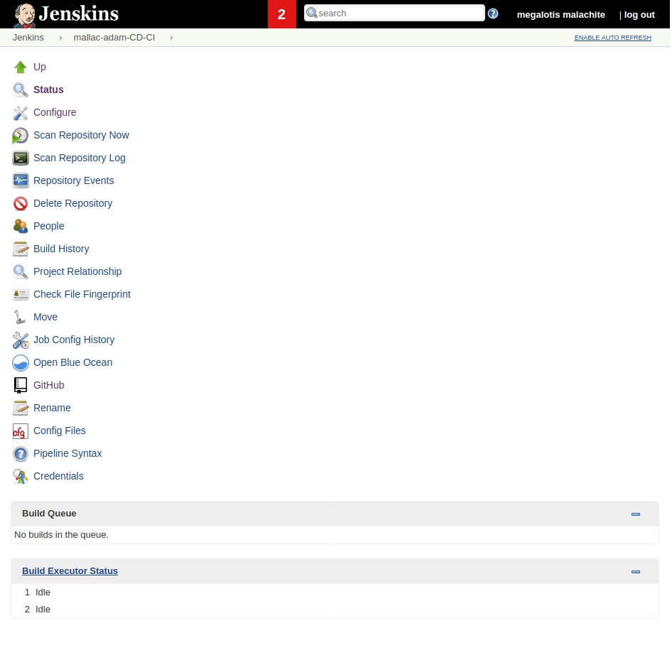

# Continuous Integration/Continuous Delivery

## Prerequisites

- AWS account
- Docker account
- Jenkins server set up (credentials for Dockerhub and AWS)
- Multibranch gitHub repository

## Creating the Jenkins job

After logging in to Jenkins click on `New item` (left side.) Name your job, then choose `Multibranch Pipeline` and click on `OK`. The configuration page will be loaded:





Adding a Display name and Description are optional.

### Branch sources

Under `Branch sources` click on `Add source` and select `GitHub`.

Select your credentials.

Enter the owner of the repository\organization in the `Owner` field.

Select the name of the repository in the `Repository` field. Note that the options might appear with a few seconds delay.

You can leave the rest of the settings of `Branch sources` on their default values.

### Build configuration

For the `Mode` option select `by Jenkinsfile`.
The `Script Path` should be `Jenkinsfile`.

You can leave the rest of the settings on their default values. Click on `Save`.

## Repo contents

The gitHub repository should contain the following files at least:
- Nodejs application
- test for the application
- Dockerfile
- Jenkinsfile
- Dockerrun.aws.json file

### Dockerfile contents
```
FROM alpine:latest
RUN apk add --no-cache nodejs npm
WORKDIR /app
COPY . /app
RUN npm install
EXPOSE 3000
ENTRYPOINT ["node"]
CMD ["hello.js"]
```

### Dockerrun.aws.json contents
```
{     
  "AWSEBDockerrunVersion": "1",          
  "Image":{       
    "Name": "adambhun/CD_CI"     
  },     
    "Ports": [       {         
      "ContainerPort": "3000",
      "hostPort": "3000"
    }     
  ]   
}
```

### Jenkinsfile contents

```
pipeline {
  environment {
    registry = "adambhun/multibranch-ci-cd"
    dockerCred = 'adambdhub'
    dockerImage = ''
  }
  agent any
  stages {
    stage('Testing') {
      steps {
        sh 'npm init -y'
        sh 'npm install'
        sh 'node anagramtest.js'
      }
    }
    stage('Building image') {
      steps{
        script {
          docker.build registry + ":$BUILD_NUMBER"
        }
      }
    }
    stage('Deploy Image') {
      steps{
        script {
          docker.withRegistry( '', dockerCred ) {
            sh 'docker push adambhun/multibranch-ci-cd:latest'
          }
        }
      }
    }
    stage('Deploy to EB') {
      steps{
        withCredentials([[$class: 'AmazonWebServicesCredentialsBinding', accessKeyVariable: 'AWS_ACCESS_KEY_ID', credentialsId: 'adam_dev_aws', secretKeyVariable: 'AWS_SECRET_ACCESS_KEY']]) {
          sh 'pip install awsebcli --upgrade --user'
          sh 'eb init --region eu-central-1 -p docker $BUILD_NUMBER'
          sh 'eb create CD-no-$BUILD_NUMBER'
          sh 'eb use CD-no-$BUILD_NUMBER'
          sh 'eb deploy'
        }
      }
    }
    stage('Cleanup') {
      steps{
        sh 'docker rmi $registry:$BUILD_NUMBER'
        sh 'rm -r node_modules'
        sh 'rm package.json'
      }
    }
  }
}
```

## Testing the Jenkins project

Find your Jenkins project on the home page of your Jenkins server and click on it.



Click on `Scan Repository Now` to begin the test. It can take up to five minutes with a simple application.

To see a detailed log of what happened, 