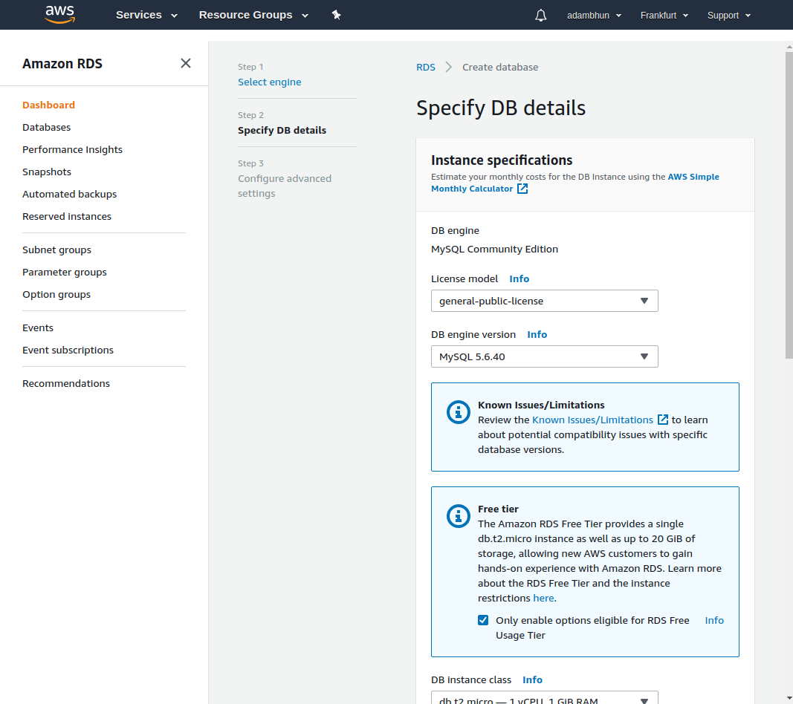
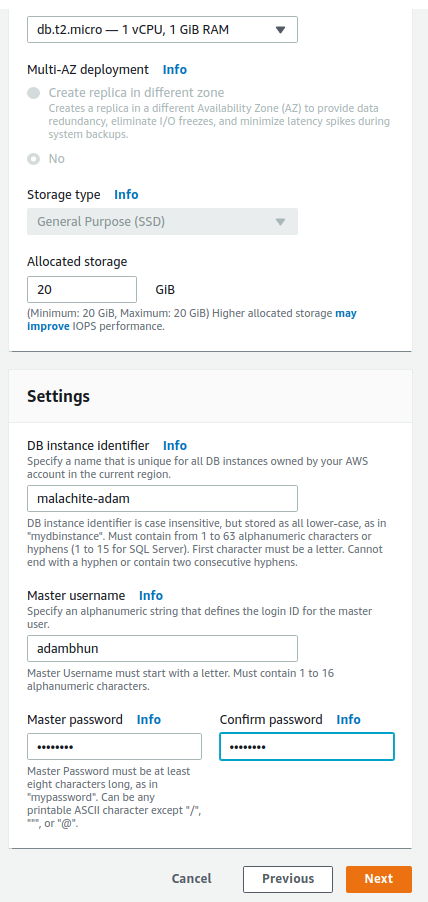
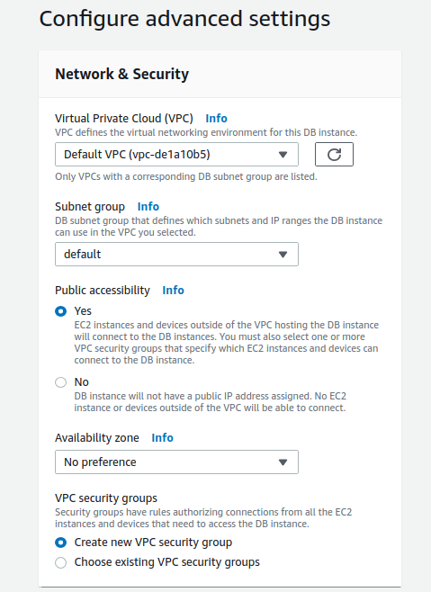
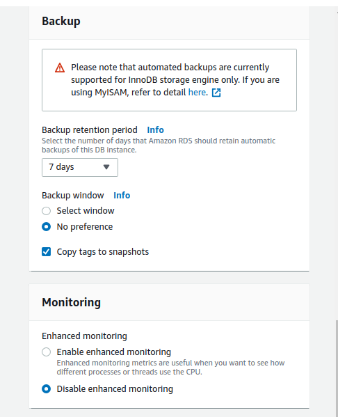
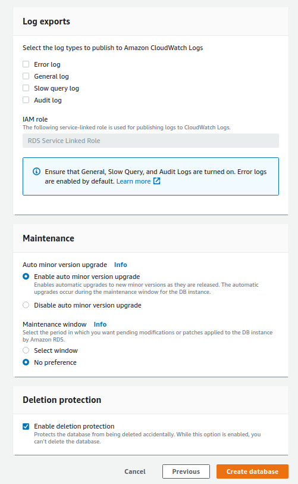
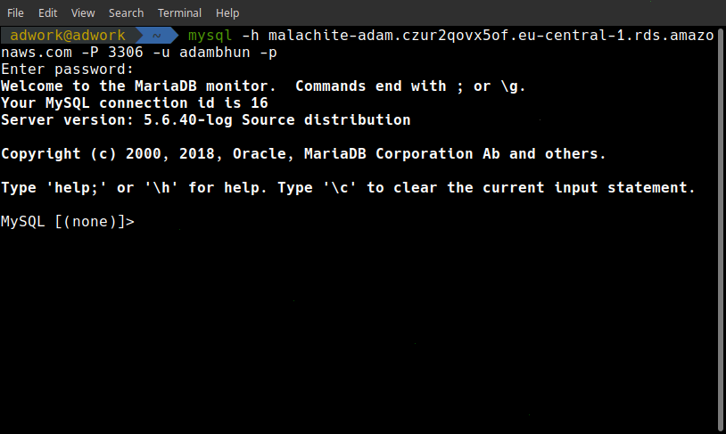

# Prerequisites

AWS account

mysql client installed

## Creating the DB

Sign in to AWS management console.

Click on `services`. Click on `RDS` under `Database`.

On the next page click either of the orange `Create database` buttons.

Select `MySQL` engine then click on `Next`.

Configure your DB on the next page, then click next.

More settings on the next page. Set them as shown below, and click on `Create database`.

Creating the Database might take a few minutes.

## Connecting to the DB

If you don't have the packages necessary to connect to the DB installed, you can install them with the following commands - on linux:

`sudo apt install mysql-client-core-5.7`
`sudo apt install mariadb-client-core-10.1`

Connect using the terminal with a command like this;

`mysql -h malachite-adam.czur2qovx5of.eu-central-1.rds.amazonaws.com -P 3306 -u adambhun -p`

where you type your database's endpoint after "-h", its port number after "-P" a username of the database after "-u". The "-p" at the end makes the terminal prompt for a password.

In case of success you should see this:

You can use standard mySQL queries on your database from this point.