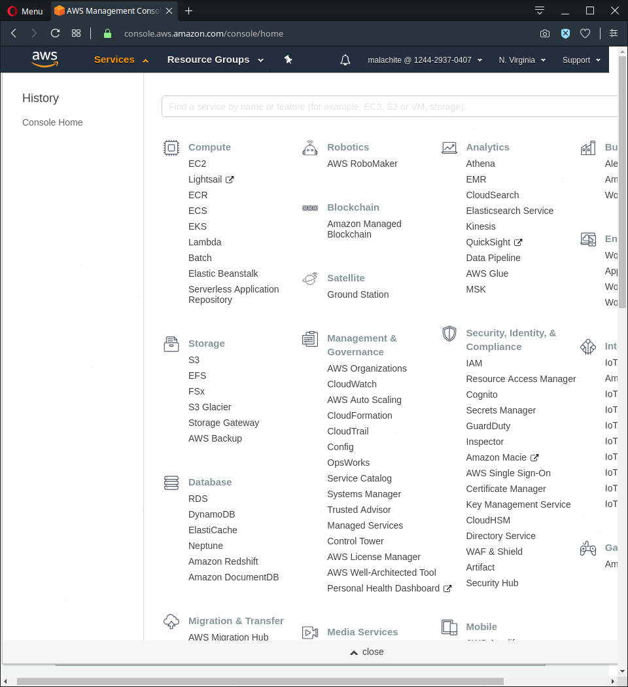
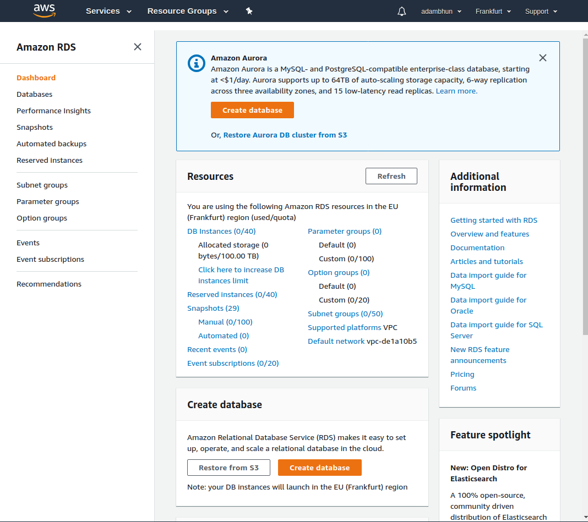
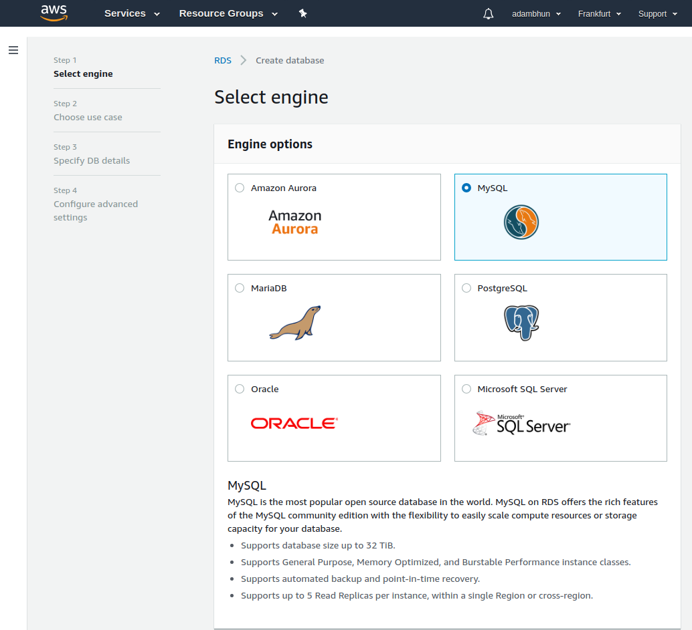

# Prerequisites

AWS account

## Creating the DB

Sign in to AWS management console.

Click on `services`. Click on `RDS` under `Database`.

On the next page click either of the orange `Create database` buttons.

Select `MySQL` engine then click on `Next`.

