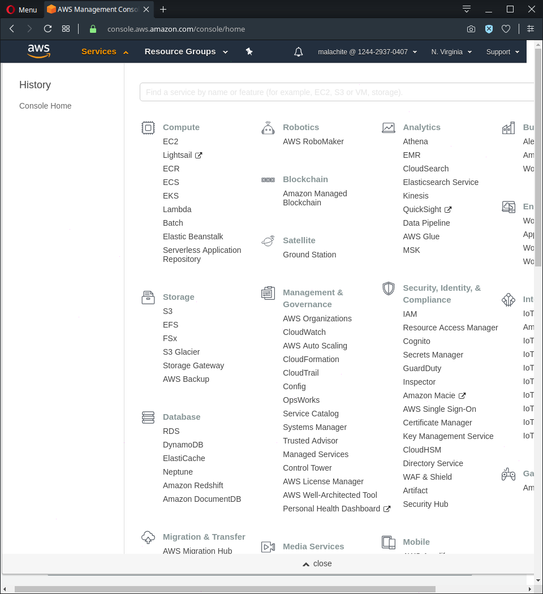

# Elastic Cloud Computing (EC2)

## Prerequisites

- IAM user with permissions to create an EC2 instance

## Creating the instance

Sign in to AWS Management Console.

Click on Services and select EC2.

pic

Click on `Launch instance` 

pic
# 1 Choosing AMI
Select `Amazon Linux AMI 2018.03.0 (HVM), SSD Volume Type`.

# 2 Choosing instance type
Choose the `t2 micro` instance.
pic

Click on `next`.

# 3 Configuring the instance

Leave the options on their default values.
pic
Click on `next`.

# 4 Adding storage

Leave the options on their default values.
pic

Click on `next`.

# 5 Adding tags

Tagging is optional.
To add one, click on `Add` on the left, and enter a key-value pair.

pic

Click on `next`.

# 6 Configuring security group

On this screen you can configure firewall rules to control the traffic for your instance.

`SSH` is needed to access the instance.
Since the deployed application will be a web server, `HTTP` should be allowed as well.

pic

Click on `Review and Launch`.

# 7 Review

Check your settings. Click on `Launch` if they are OK.

pic

# 8 Key pair

A window like the one below will pop up.

pic

Choose `Create a new key pair`, name it, and then download it.
`WARNING`: Store it in a secure and accessible location. You will not be able to download it again.

Click on `Launch Instances`.

## 9 Connecting - on Linux

Next page:

pic

Click on `View Instances`

Launching may take a few minutes. Once it's ready you should see this:

pic

### Hiding the private key file

Open the folder where your private key file is located in a terminal.
Enter the following command:
`chmod 400 /path_to_key/my_key.pem`

### SSH

putty
Enter the following command:
`ssh -i /path_to_key/my_key.pem user_name@public_dns_name`

You might see the following result:

pic

