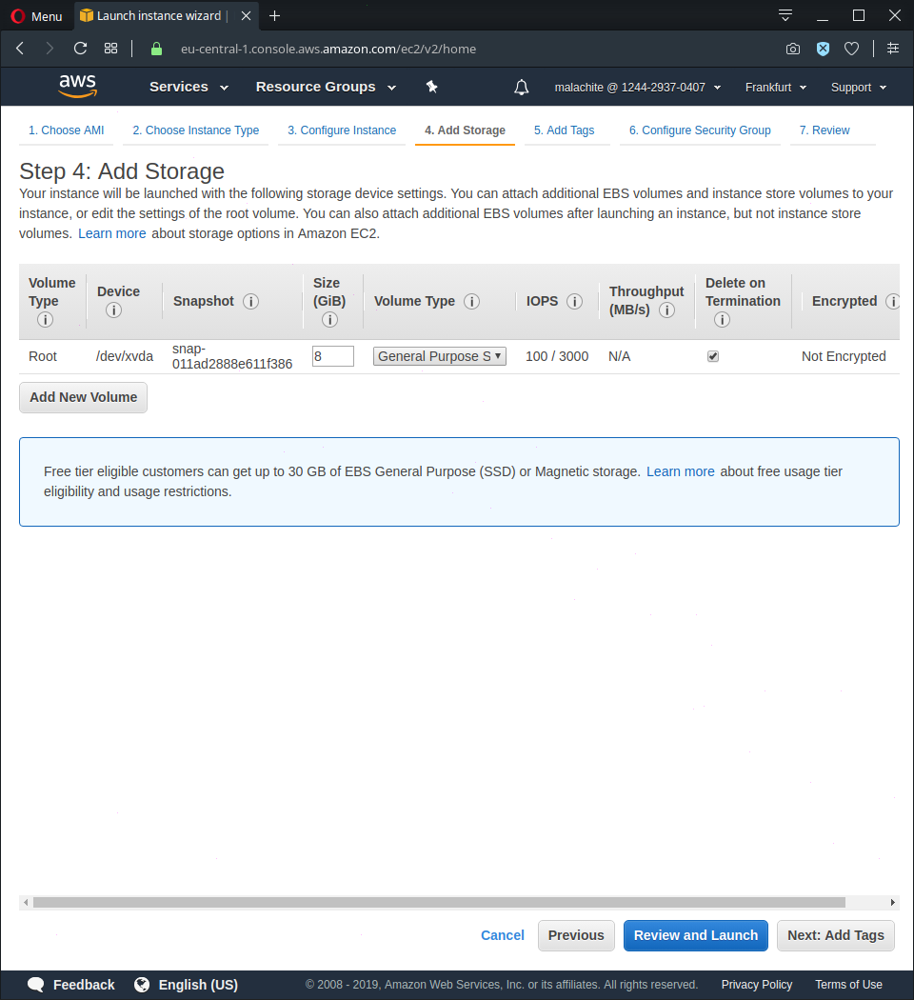

# Elastic Cloud Computing (EC2)

## Prerequisites

- IAM user with permissions to create an EC2 instance

## Creating the instance

Sign in to AWS Management Console.

Click on Services and select EC2.

Click on `Launch instance` 

# 1 Choosing AMI

Select `Amazon Linux AMI 2018.03.0 (HVM), SSD Volume Type`.

# 2 Choosing instance type

Choose the `t2 micro` instance.

Click on `next`.

# 3 Configuring the instance

Leave the options on their default values.

Click on `next`.

# 4 Adding storage

Leave the options on their default values.

Click on `next`.

# 5 Adding tags

Tagging is optional.
To add one, click on `Add` on the left, and enter a key-value pair.

Click on `next`.

# 6 Configuring security group

On this screen you can configure firewall rules to control the traffic for your instance.

`SSH` is needed to access the instance.
Since the deployed application will be a web server, `HTTP` should be allowed as well.

Click on `Review and Launch`.

# 7 Review

Check your settings. Click on `Launch` if they are OK.

# 8 Key pair

A window like the one below will pop up.

Choose `Create a new key pair`, name it, and then download it.
`WARNING`: Store it in a secure and accessible location. You will not be able to download it again.

Click on `Launch Instances`.

## 9 Connecting - on Linux

Next page:

Click on `View Instances`

Launching may take a few minutes. Once it's ready you should see this:

### Hiding the private key file

Open the folder where your private key file is located in a terminal.
Enter the following command:
`chmod 400 /path_to_key/my_key.pem`

### SSH

Note: if you are using Windows use PuTTY to create an SSH connection.

Enter the following command:
`ssh -i /path_to_key/my_key.pem user_name@public_dns_name`

Note: Since a Linux instance was created the user name is 'ec2-user'. You can check the public DNS name of your instance on the AWS Console page after creating the instance. My command looked like this.

`ssh -i ./malachite_adam_hello.pem ec2-user@ec2-3-122-226-231.eu-central-1.compute.amazonaws.com`

You might see the following result:

Proceed as shown in the pictures.

## Deploying the Nodejs application

### Prerequisites

Install node version manager (nvm) by typing the following at the command line.

`curl -o- https://raw.githubusercontent.com/creationix/nvm/v0.32.0/install.sh | bash`

Activate nvm with the command below:

`. ~/.nvm/nvm.sh`

Install Node.js with the command below:

`nvm install 4.4.5`

Note: installing Node.js also installs `npm`, so you can install additional modules from this point.

### Getting your application on your instance

One way of doing this, is by cloning a git repository containing your application to your instance. [my repo](https://github.com/green-fox-academy/malachite_ops_adam_ec2) (Note the package.json file; express is listed as a dependency of my application, so it will be installed after giving the command 'npm install')

To do this, you need to install git on your instance. The following command does that:
`sudo yum install -y git`

Then, clone the repository to your instance with this command (substitute the link with a link to your repo):
`git clone https://github.com/green-fox-academy/malachite_ops_adam_ec2.git`

Change the active directory to your repo's folder:
`cd malachite_ops_adam_ec2`

Install the dependencies needed to run your application (supposing a package.json file is present):
`npm install`

Run your application with the command
`node hello.js`

Test your application by entering your instance's url and the port number your application listens to with a browser.

