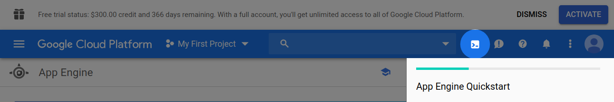
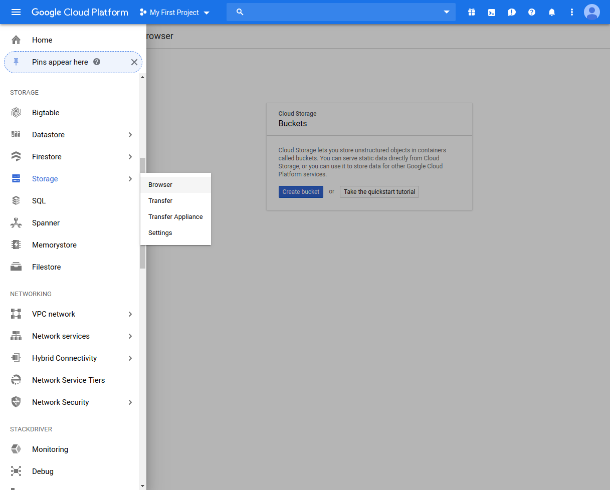
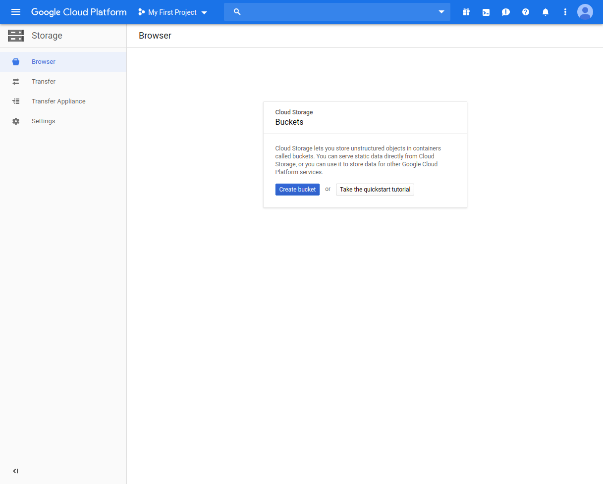
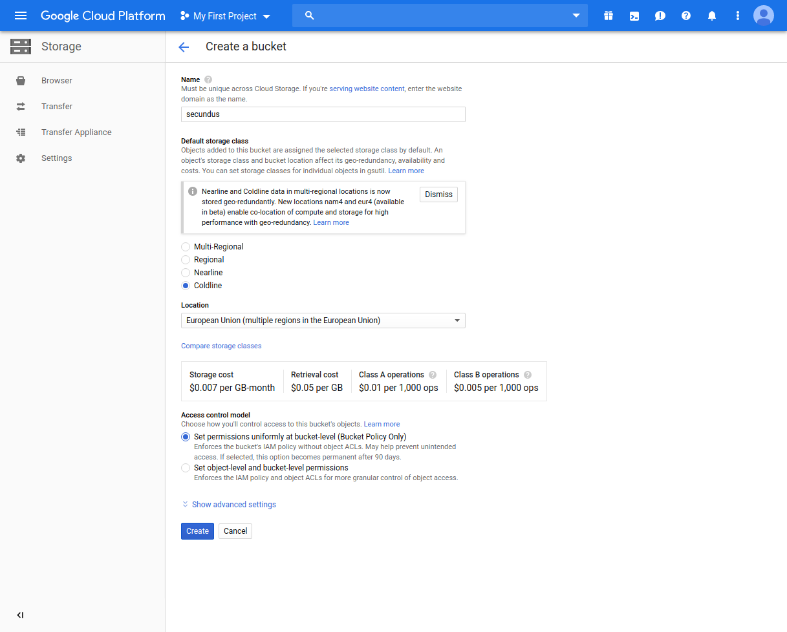
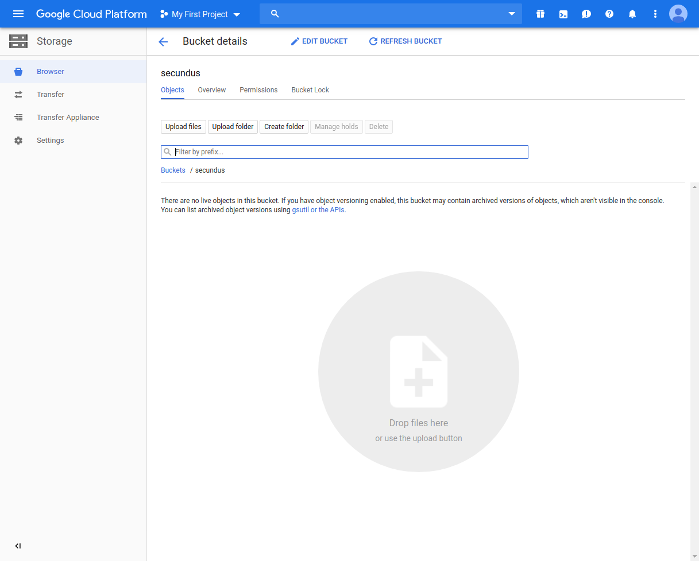
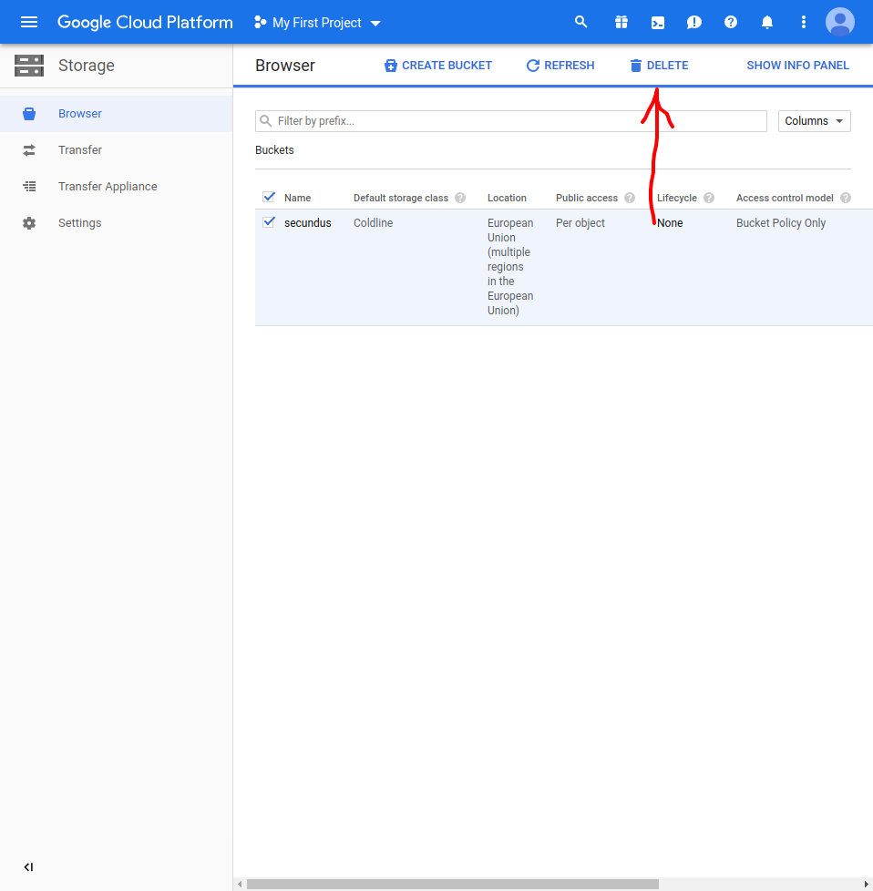
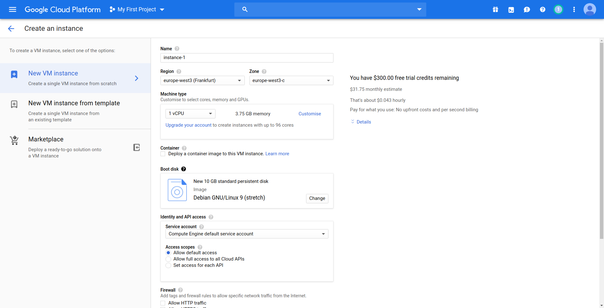
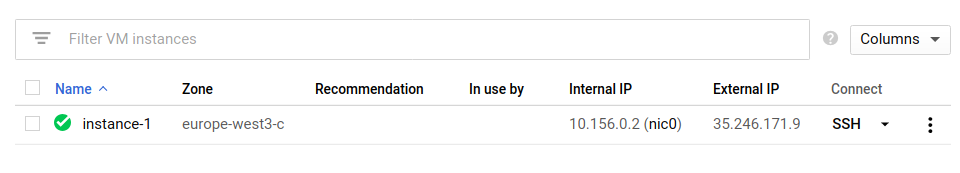

# Advantages of using GCP


 - Security, privacy and transparency.
GCP provides features like encryption for all data, building services in private IP environments. GCP adheres to security and privacy standards, which are verified by third-party auditors.
GCP lets you know where your data is stored and provide access to it as per your instructions.


 - Efficient solutions with technologies like hybrid cloud and machine learning


# App engine


GCP's App engine is analogous with AWS's Elastic Beanstalk.


To create an application sign in and select App Engine under "Compute" from the menu on the left. 
App Engine needs a project to create resources. Create or select an existing project. Confirm the selection.
You need to use the Cloud Shell to start. Click on the icon that looks like this:



Standard shellscript works with it. For example you might clone an app with a command like this:

```
git clone \
    https://github.com/GoogleCloudPlatform/nodejs-getting-started
```

Create your app in a region and deploy it with these two commands:

```
gcloud app create
gcloud app deploy
```

Manage your app by clicking on `App Engine` from the menu on the left, and then on settings.


# Cloud Storage


Google Cloud Storage is analogous with AWS's Simple Storage Service.

To create a bucket sign in and select Storage from the menu on the left. Select browser. Click on create bucket.
Cloud Storage needs a project to create resources. Create or select an existing project. Confirm the selection.
Next, you have to name your bucket and choose a type - and possibly a location for it. The type determines how much the bucket costs.




Next you can upload files or folders and set permissions and policies for each.





To delete a bucket go back to "Browser", tick the checkbox next to the bucket's name and click on delete. If you don't see a delete button, click on the three dots button to make it appear.

# Compute Engine


Compute Engine is analogous with AWS's Elastic Compute Cloud.

To create a VM instance, select VM instances from the navigation menu in the Compute Engine row and click on `Create Instance`. Configure your instance here:



Then you should see everything you need to connect to your database and further configuration options. You can delete your instance by clicking on the trashcan icon.




# Cloud SQL


Cloud SQL is analogous with AWS's Amazon RDS.


To create a Cloud SQL instance, select SQL from the navigation menu and click on `Create Instance`. Select the SQL version you want to use. Configure your instance on the next page.
Creating the instance might take a few minutes. When it's done, click on the name of your instance. Then you should see everything you need to connect to your database and further configuration options. You can delete your instance by clicking on the trashcan icon.