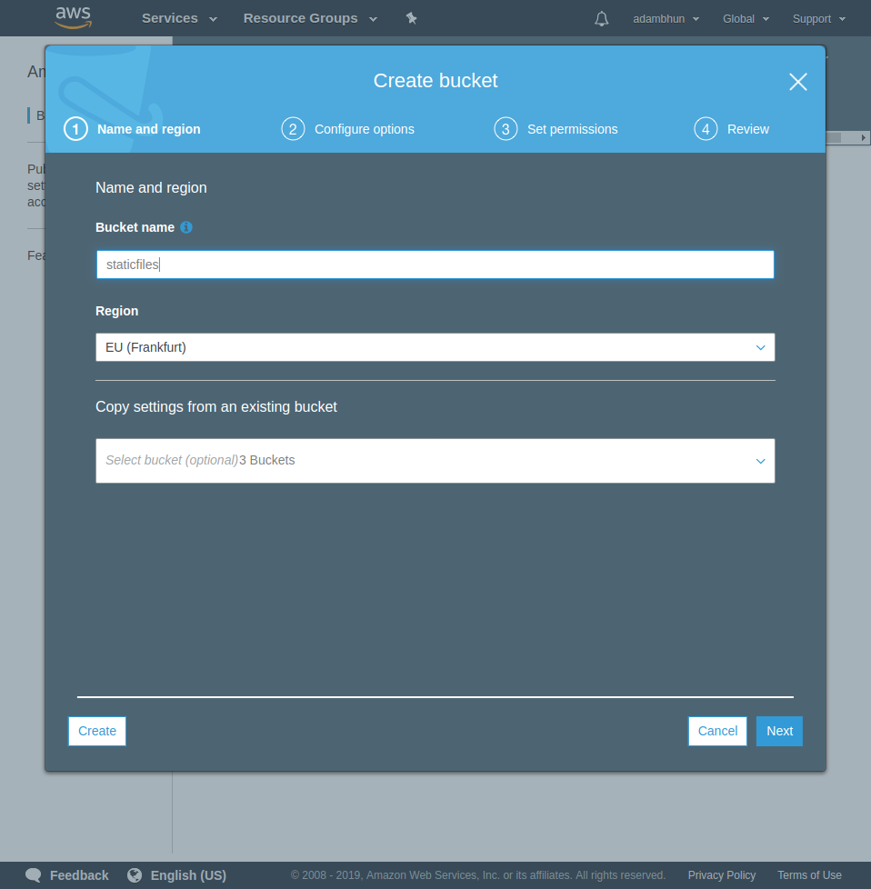
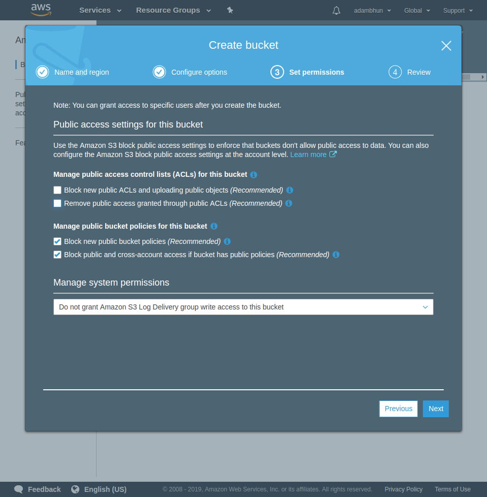
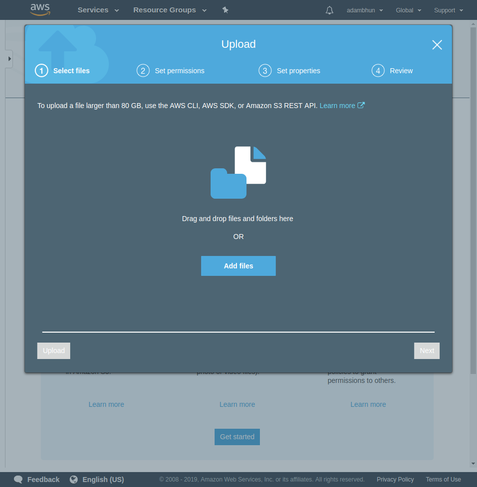
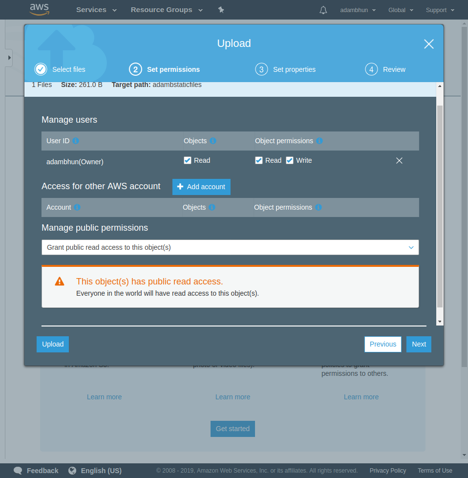
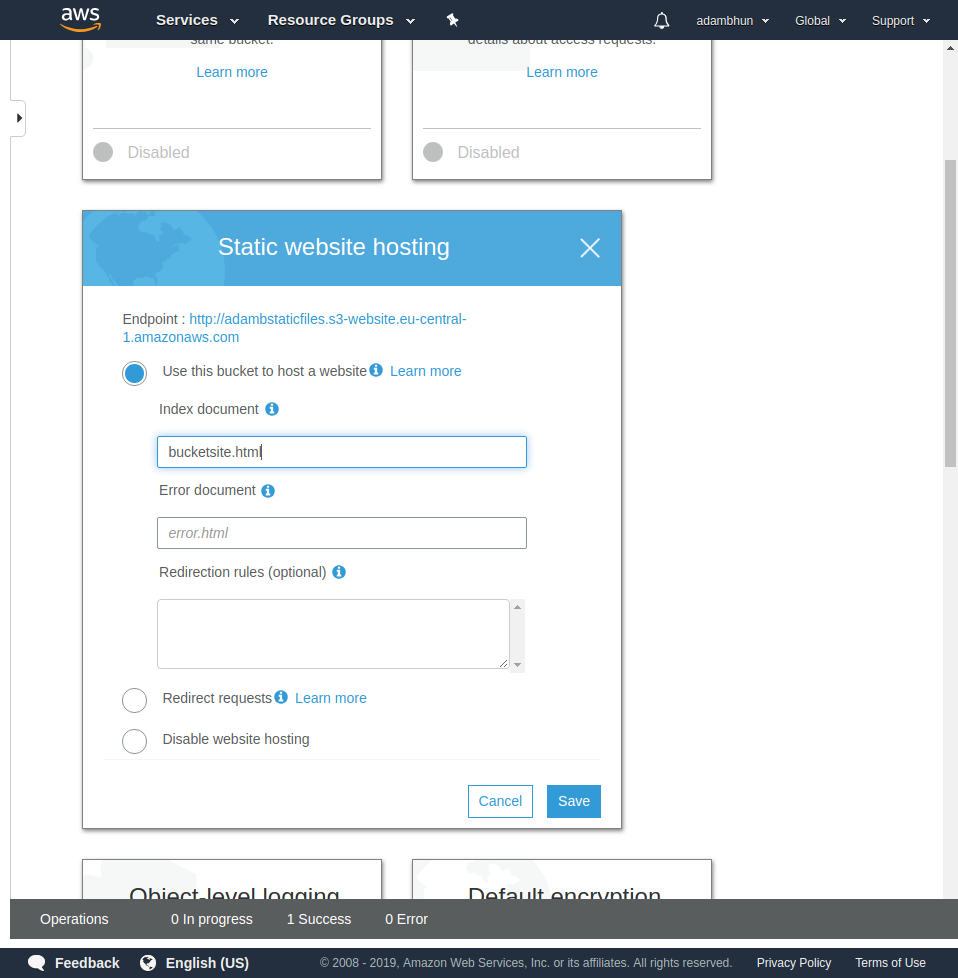

# Static files in the cloud

## Prerequisites

AWS Account 

## Creating the bucket

Log in to AWS.
Click on servicees.
Select `S3` under `Storage` from the drop-down menu.
On the next page, click on the blue `Create bucket` button.

Give it a name, select a region and click on `Next`.
The default settings are adequate for a simple bucket to store static files. Click `Next`.
To make the bucket publicly available, set the settings as shown in the picture below:

Click on `Next`.

Check your settings then click on `Create bucket`.

Click on your newly created bucket in the list of buckets.
Click on the `upload` button on the next page.

Select a file, then click on `Next` again.

To make the bucket publicly available, set the settings as shown in the picture below:
 

Click on `Next`.

Use the default settings.

Check your settings then click on `Next`.

Click on the `Properties` button.

Enable `Static website hosting`, then check `Use this bucket to host a website` and enter the names of the files you uploaded. Save the url. Finally click on save.

